> - ❌ 아니! 분명 AWS에 EC2를 생성해서 ssh를 오픈했는데 왜 접속이 안 되나요?
> - ❌ 외부 환경에서 IDC에 있는 회사 서버에 접속이 안 돼요!
> - ❌ 집 로컬 환경에서 서버를 열어두었는데 외부에서 집에 있는 서버가 접속이 안 돼요!

혹시 여러분도 **위와 같은 일들을 겪어 보신 적이 있으신가요?**

저는 위와 같은 일들을 많이 겪어봤고, 학교를 다니기 전 보안 회사에서 **UTM이라는 방화벽 장비를 다루며 고객사에서 위와 같은 문제들로 인해 직접 트러블 슈팅한 경험**이 많았었습니다. 

저는 그때마다 가장 먼저 확인해보는 것이 있는데요! 그것은 바로 **네트워크 패킷**입니다. 위에서 말하는 **접속**이라는 것은 결국 `출발지`에서 `목적지`로 접속한다는 것으로 결국 접속할 때는 `출발지`에서 `목적지`로 **접속을 위한 패킷을 보내게 됩니다**. 이것은 단순히 SSH 접속뿐만이 아니라 **HTTP 접속, MySQL의 서비스 포트인 3306 포트를 접속할 때도 적용되며 대다수의 서비스에 적용**된다고 보시면 될 것 같아요.

그럼 **트러블 슈팅하는 방법을 배우기 전에 알아두면 좋은 내용**에 대해서 먼저 간단하게 말씀드리고 넘어가도록 하겠습니다.

### 트러블 슈팅을 위한 배경 지식

#### 기본적인 네트워크 환경

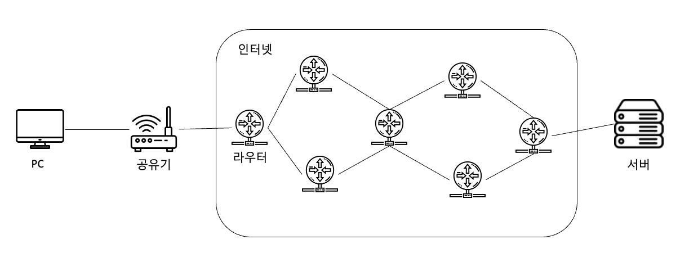

보통 일반적인 네트워크 환경을 보면 집 PC에서 공유기를 통해 외부 인터넷에 접속하고 목적지인 서버에 접속하는 방식으로 이루어져 있습니다. 외부 인터넷은 **수많은 라우터가 서로 연결되어 있는 형태로 집에 있는 PC와 서버가 연결**될 수 있는 거죠! 그렇다면 서로 어떤 방식으로 통신하는 걸까요?


#### IP가 포함된 네트워크 환경

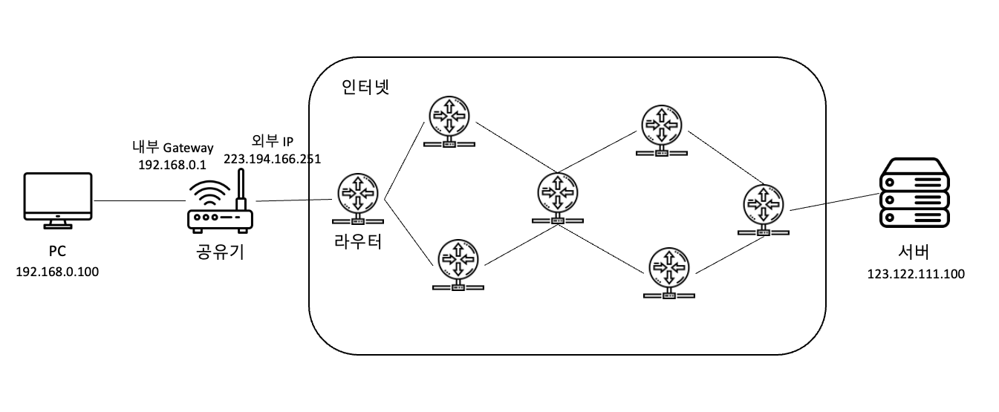
서로 통신하기 위해서는 **별도의 주소**를 가지고 있어야 합니다. 저희가 네이버 지도 앱을 켜서 목적지로 갈 때 출발지와 목적지를 입력하듯 네트워크 통신도 마찬가지로 각 장비마다 별도의 고유 주소가 필요하며 출발지 주소에서 목적지 주소를 바라보고 경로를 탐색해서 찾아가게 됩니다. **네트워크에서는 그 고유한 주소를 IP**라고 불러요!

예를 들어 **192.168.0.100**이라는 집 PC에서 **123.122.111.100**이라는 외부 웹서버를 접속한다고 가정해보겠습니다.

> 1. 192.168.0.100인 집 PC에서 웹 브라우저로 123.122.111.100이라는 웹서버에 접속합니다. (실제로는 도메인을 입력하는 경우가 많겠죠? 하지만 도메인도 실제로는 모두 IP로 이루어져 있답니다!)
> 2. 그럼 이때 192.168.0.100이라는 집 PC(출발지)에서 패킷을 만들어 공유기의 Gateway인 192.168.0.1로 보내게 되고,집 PC IP였던 192.168.0.100을 223.194.166.251이라는 외부 IP로 변환시켜 외부 인터넷으로 전달하게 됩니다.(내부 PC의 IP를 공유기의 외부 IP로 변환하는이유는 NAT에 대해서 찾아보시면 좋을 것 같아요.)
> 3. 이때 패킷에는 목적지 IP가 담겨 있는데 이 목적지 IP를 활용하여 라우터들이 계속 경로 설정을 하여 123.122.111.100이라는 서버에 도달할 수 있게 해줍니다.


이렇게 간략하게 IP를 통해 네트워크에서 서버와 클라이언트가 어떤식으로 서로 통신하는지에 대해서 알 수 있었는데요. 여기서 중요한 것은 2번에 나왔던 **패킷**입니다. 네트워크에서 말하는 패킷은 **컴퓨터 네트워크에서 전달하는 데이터의 형식화된 블록**입니다. 즉 클라이언트인 192.168.0.100 PC에서 웹 서버인 123.122.111.100 서버로 웹 페이지를 요청할 때 페이지를 받아오는 과정, 요청하는 과정 등 서로 통신을 해야 하고 이 통신에 송신, 수신되는 데이터가 바로 패킷이라고 볼 수 있습니다.

#### 3way Handshake
지금까지 IP를 통해 서로 통신하고 통신할 때는 패킷을 이용하여 데이터를 송, 수신받는다고 했습니다. 근데 이 통신을 하기 위해서 그냥 패킷을 보내고 받으면 끝이 아닐까? 생각이 들 수도 있겠지만 실제로는 3way Handshake라는 과정을 통해 먼저 클라이언트와 서버가 연결되어있는지 확인하는 과정이 있습니다.

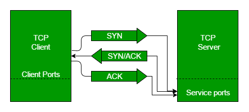

**[출처 geeksforgeeks]**

**3way handshake과정**

> 1. SYN : 클라이언트가 서버와의 연결을 위해 SYN이라는 플래그를 보내어 연결 요청을 보냅니다.
> 2. SYN/ACK : 서버가 클라이언트의 연결 요청을 받아 연결할 수 있다고 판단되면 SYN/ACK 플래그를 클라이언트에게 보내줍니다.
> 3. ACK : 클라이언트는 서버의 응답을 확인하고 둘 다 실제 데이터 전송을 시작할 안정적인 연결을 설정합니다.

다시 정리해보면 클라이언트에서 서버로 접속할 때 IP를 이용하여 통신을 하는데 그때 패킷을 통해 데이터를 전송하게 되고 통신을 연결하기 전 3way Handshake를 통해 연결 요청을 확인할 수 있다고 볼 수 있습니다. 이때 3way Handshake도 클라이언트가 SYN 패킷을 서버로 보내고, 서버가 SYN/ACK 패킷을 날리며 3way Handshake도 결국 패킷을 이용한 통신 중에 하나로 볼 수 있습니다.

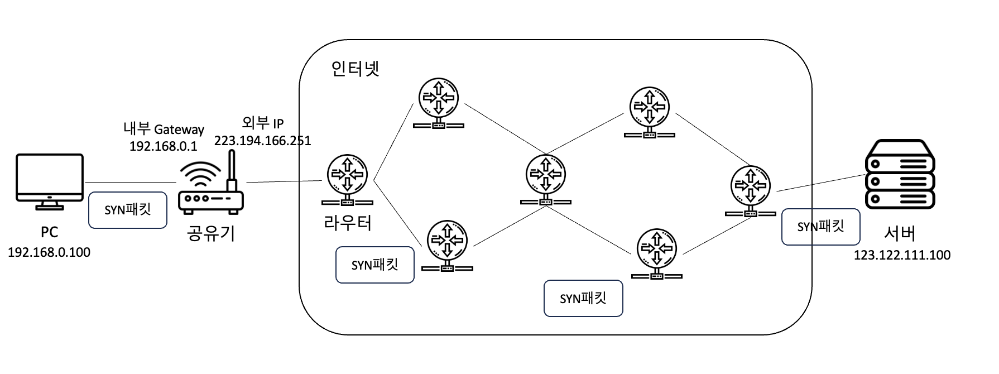

그럼 **통신을 위해 가장 먼저 발생하는 것이 SYN 패킷**인 거고 저희는 이 **SYN 패킷을 추적**한다면 서버 접속이 안 되고 있는 구간을 알 수 있지 않을까요?

#### tcpdump
저희는 클라이언트에서 서버로 요청하는 SYN 패킷을 가로채서 확인하기 위해 tcpdump라는 소프트웨어를 사용할 겁니다. tcpdump는 네트워크에서 전송되는 패킷을 가로채서 표시할 수 있게 해주는 소프트웨어로 대부분의 유닉스 계열 운영 체제에서 사용 가능합니다. 윈도우에서는 **wireshark**라는 프로그램을 이용할 수 있으며 현재 진행되는 과정들은 tcpdump를 지원하는 유닉스 계열 운영 체제에 해당합니다. 설치를 제외한 나머지 과정은 MacOS에서 진행되며 대다수의 유닉스 계열에 네트워크 관련된 인터페이스가 설치되어있는 경우 tcpdump가 깔린 경우가 많습니다.

**설치**
``` linux
// Ubuntu 기준(다른 리눅스 계열도 비슷한 방식으로 설치합니다.)
# apt install tcpdump
```

**네트워크 인터페이스 조회**

노트북을 기준으로 생각해보았을 때 노트북은 무선, 유선 2가지가 있고 이 2가지에 모두 IP를 할당받을 수 있습니다. 노트북에는 유선 랜카드, 무선 랜카드 2개의 랜카드가 있다고 볼 수 있으며 인터넷에 연결된 랜카드를 통해 패킷이 나가게 됩니다. 그럼 제 노트북을 기준으로 알아 보도록 하겠습니다. 

```
# ifconfig
```
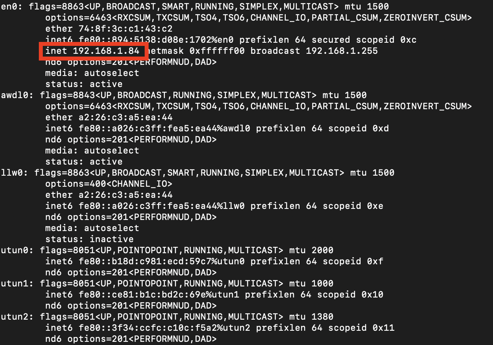

ifconfig를 입력했을 때 가장 왼쪽위에 `:` 왼쪽에 쓰여 있는 것이 네트워크 인터페이스(랜카드)의 이름이며 여러 개가 나오는데 그 중 inet이 입력되어있는 곳이 IP가 부여되어 사용하고 있는 곳으로 볼 수 있습니다.(유선, 랜선 둘 다 사용하면 inet이 적혀있는 인터페이스가 2개 있을 수 있음!) 저는 en0이라는 네트워크 인터페이스명을 가지고 있고 192.168.1.84라는 IP를 가지고 있네요!

**특정 네트워크 인터페이스에서 나가는 패킷 조회**
```
# tcpdump -nni en0
```
위에 적힌 명령어는 en0이라는 네트워크 인터페이스를 감시해서 실시간으로 출력하겠다는 뜻입니다.

-  `-i` : 네트워크 인터페이스를 설정하는 옵션
-  `-n` : 한 번의 n은 IP 주소를 이름으로 변환하지 않고 두 번의 n을 입력할 경우 IP와 포트를 이름으로 변환하지 않습니다.

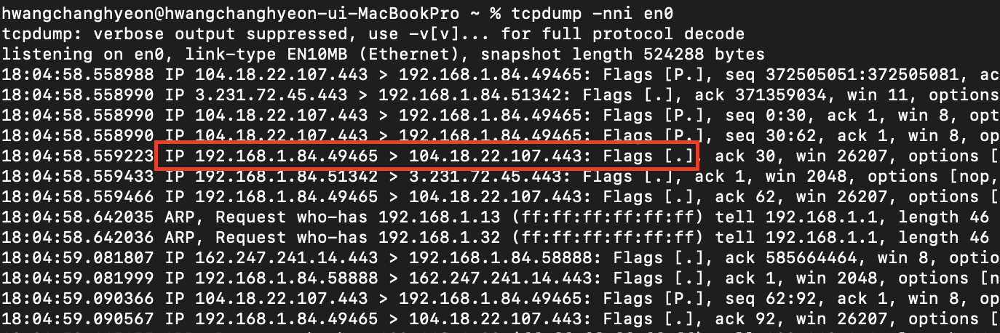

실행하고 바로 취소를 눌러 캡처된 패킷입니다. 빨간색으로 표시된 부분을 보면 제 노트북 무선 랜카드에 적혀있는 IP인 192.168.1.84번 출발지에서 104.18.22.107 IP의 443포트인 목적지로 패킷이 나가고 있는 것을 볼 수 있습니다. 443포트는 https로 저는 현재 https로 되어있는 웹사이트를 접속해 있기 때문에 위와 같이 패킷이 나오게 되는 겁니다. 그 뒤에 Flags를 볼까요? 제가 자세히 말씀드리진 않았지만 SYN, ACK와 같은 플래그들이 더 있습니다. dot(.)은 ACK Flag로 봐도 무방하며 연결 후 통신이 이루어지고 있다고 보면 좋을 것 같아요. 

이렇게 출발지 IP에서 목적지 IP로 가는 패킷에 Flag가 담겨있으므로 어느 목적지 서버를 접속할 때 출발지 네트워크 인터페이스에서 SYN 패킷이 목적지 IP로 날아가는지, 그리고 서버에서도 동일하게 서버의 인터페이스에서 클라이언트가 보낸 SYN 패킷이 들어오는지 확인해보면 연결 요청에 대해서 트러블 슈팅 해볼 수 있지 않을까요? 

### 실 예제

#### 클라이언트에서 정상적으로 서버에 접속되는 경우

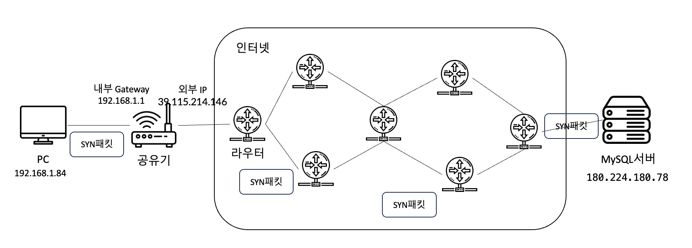

현재 저는 카페에 있고 카페 무선 와이파이로 받은 IP는 192.168.1.84이고 집에 테스트를 하기 위해 열어둔 MySQL서버는 180.224.180.78번 입니다. 제 노트북인 192.168.1.84에서 MySQL Workbench로 집에 있는 180.224.180.78을 접속해보겠습니다. 접속할 때는 아래와 같이 명령어를 통해 패킷을 캡처해보도록 하겠습니다.

```
# tcpdump -nni en0 port 33306
```

명령어에 port를 입력하는 경우 특정 포트를 선택해서 캡처할 수 있습니다.(집에 있는 MySQL서버는 테스트 용도로 3306 포트가 아닌 33306포트로 오픈되어있는 상태입니다.)


**클라이언트에서 확인한 tcpdump**
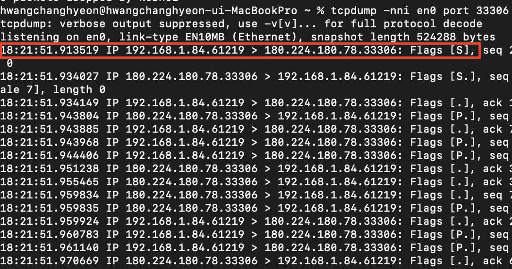

위 사진은 클라이언트에서 캡처한 패킷인데 192.168.1.84에서 180.224.180.78의 33306포트로 SYN패킷이 나가는 것을 확인할 수 있습니다. 아래 S.의 경우 SYN/ACK를 표현하는 뜻이며 그 뒤에 바로 .이 나온 것을 보면 정상적으로 연결된 것을 확인해볼 수 있습니다. 그럼 반대편인 MySQL서버에서도 확인해볼까요?

**서버 네트워크 인터페이스 확인**
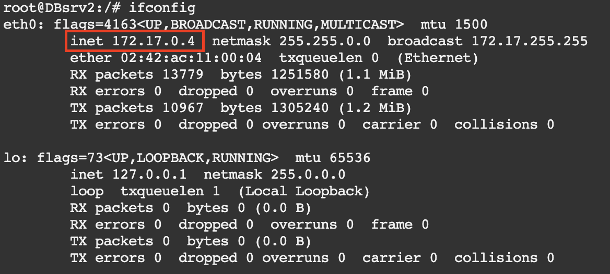

우선 MySQL 서버의 IP는 172.17.0.4이고 eth0이라는 네트워크 인터페이스를 이용하고 있습니다. 서버의 IP인 180.224.180.78도 외부 IP일 뿐 NAT가 적용되고 현재 도커로 돌린 MySQL이기 때문에 위와 같이 172.17.0.4로 나오게 됩니다. 출발지에서 보기에는 서버는 **180.224.180.78** IP를 가지고 있다고 봐주시면 될 것 같아요!


**서버에서 확인한 tcpdump**
```
# tcpdump -nni eth0
```
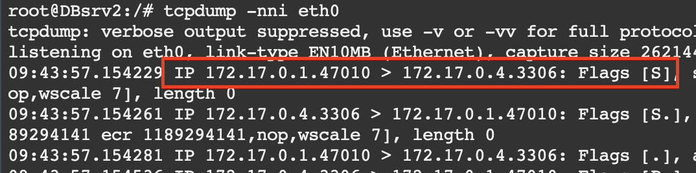

출발지 172.17.0.1에서 172.17.0.4의 3306포트로 SYN 패킷이 들어온 것을 보실 수 있습니다. 현재 출발지 IP가 카페 외부 IP인 39.115.214.146으로 나오지 않는 이유는 현재 제가 도커를 이용해서이고 33306포트가 아닌 3306으로 나오는 이유도 도커의 외부포트 내부포트를 변경해서입니다. 

현재 저 빨간색 패킷 부분은 결국 39.115.214.146이라는 제 노트북이 저의 집에 있는 서버인 180.224.180.78의 33306포트로 접근했다 라고 생각해주시면 될 것 같아요.

#### 클라이언트에서 정상적으로 서버에 접속되지 않는 경우

**1. 서버가 Down 되어있을 때**

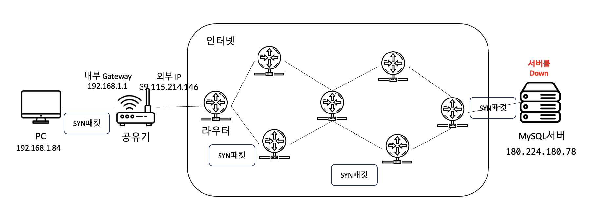

**클라이언트에서 확인한 tcpdump**
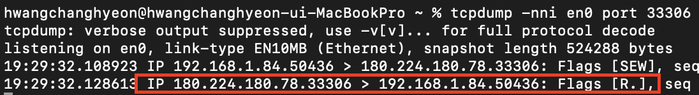

**SEW는 SYN ECE CWR의 약자입니다.**
- SYN은 새로운 연결을 시작한다는 이야기이고
- ECE는 Explicit Congestion Notification이라는 TCP혼잡제어 기능을 사용할 수 있다고 알려주는 것입니다.
- CWR(Congestion Window Reduced)은 슬라이딩윈도우의 윈도우 사이즈를 줄여달라는 뜻입니다.
  
결국 SEW도 SYN의 일종으로 SYN을 보냈으나 S.가 아닌 R. 연결종료가 나왔으므로 서버와 정상적으로 연결될 수 없는 것을 알 수 있습니다. 이때 클라이언트에서는 SYN을 보낸 게 확인되었기 때문에 SYN을 보낸 클라이언트에서는 전혀 접속하는 데 문제가 없는 것이고 서버 쪽을 확인해보아야 한다고 유추할 수 있게 됩니다.

**2. 서버 상단의 방화벽이 막고 있을 때**

실제로 중요한 회사 서버들은 서버 앞단에 방화벽 같은 보안 장비를 두는 경우가 많습니다. 소프트웨어 단계에서의 방화벽도 있으며 하드웨어든 소프트웨어로 이루어져 있든 MySQL서버 앞단에서 33306으로 들어오는 포트를 차단할 경우 외부에서는 내부에 있는 MySQL서버를 접속하지 못하는 거죠. 제가 회사에 다니며 겪었던 가장 흔한 일 중의 하나였습니다.

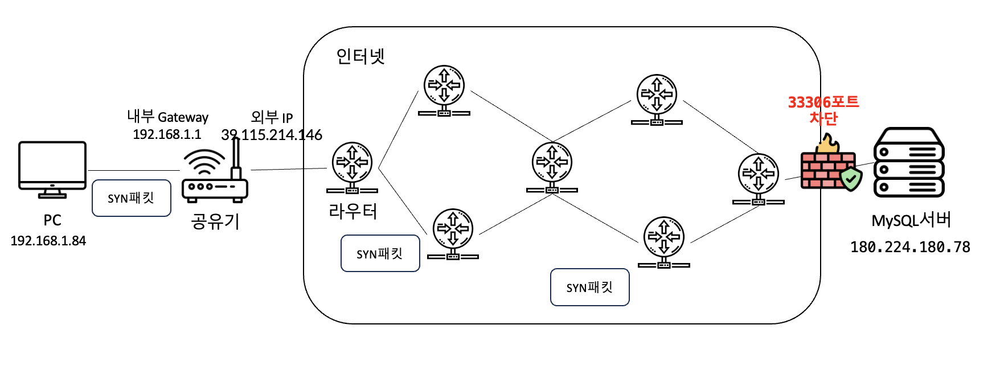

**클라이언트에서 확인한 tcpdump**
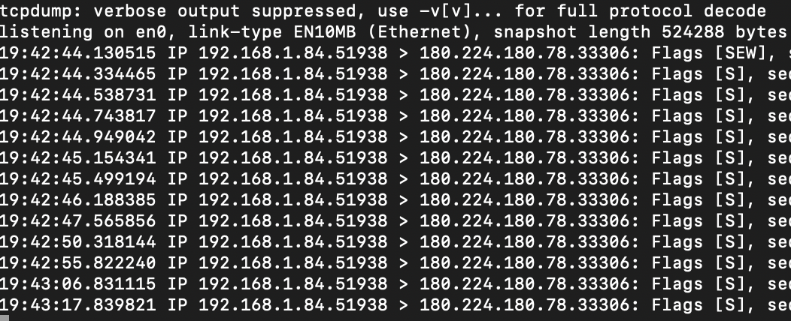

180.224.180.78로 계속 SYN 패킷을 날리고 있습니다. 위에서 서버가 다운되었을 때는 찾지 못해 R. Flag가 뜨며 바로 종료되었으나 현재 서버는 다운되지 않았지만, 방화벽에 의해 포트가 차단이 되어 SYN 패킷은 날아가지만 서버에서는 응답은 없는 현상이 발생하는 것입니다. 그럼 MySQL서버는 다운되지 않았으니 클라이언트가 서버에 접속 요청을 보낼 때 패킷을 한 번 캡처해볼까요?

**서버에서 확인한 tcpdump**
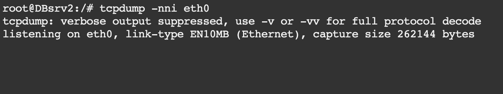

예상하셨겠지만 **아무런 패킷을 받을 수 없었습니다**. 서버 상단에 있는 방화벽에서 패킷을 막고 있기 때문에 방화벽을 통과할 수 없어 이런 현상이 발생하고, 이처럼 클라이언트에서 나가는 것은 확인했는데 서버까지 안 들어온다고 하면 클라이언트에서 출발 이후 서버에게 도착하기전까지 어떤 장비나 소프트웨어에 의해 막혀있다고 판단할 수 있는 거죠. 

방화벽 차단뿐만 아니라 포트포워딩을 잘못 설정했을 때, AWS에서 보안 그룹 설정을 잘못했을 때 등 다양한 원인에 의해 발생할 수 있습니다. 


### 마지막으로

클라이언트에서 서버로 접속이 안 되는 경우는 사실 어디가 잘못되었다고 쉽게 특정할 수는 없습니다. 정말 다양한 원인에 의해 발생할 수 있는 문제이지만 앞에서 말씀드린 것처럼 tcpdump를 이용한다면 네트워크 어느 구간에서 문제가 있는지 유추할 수 있어 시간을 절약할 수 있습니다.

모든 분이 이해하기 쉽게 작성하기 위해 자세하게 적기보다는 어떠한 원리로 트러블 슈팅할 수 있는지에 초점을 맞춰서 글을 작성했습니다. tcpdump는 실제로 활용할 수 있는 방법이 많으므로 한 번 따로 공부해보시는 것도 추천해 드립니다!


### 번외
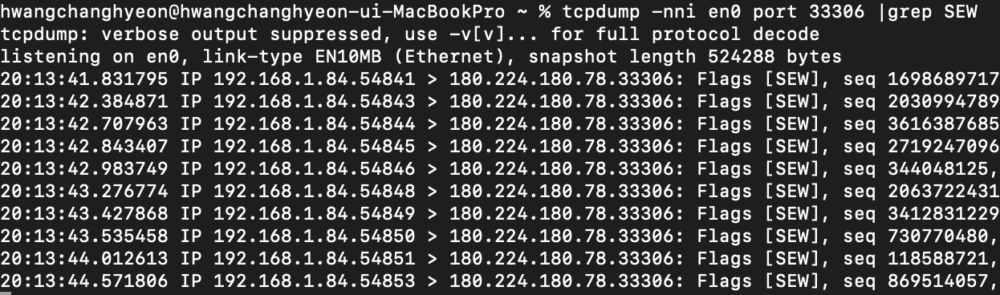

SpringBoot에서 JDBC를 사용하면 Hikari CP(커넥션 풀)를 이용하게 되는데 이때 값을 설정하지 않으면 디폴트 값으로 웹서버와 DB서버 사이에 풀을 10개 만들게 됩니다. 이것도 사실 데이터베이스와 웹서버가 네트워크 통신으로 이루어지기 때문에 위와 같이 패킷을 캡처해서 실제로 **10번의 요청을** 보내는지 알 수 있게 됩니다. 위 사진에서도 SEW 즉, SYN 패킷이 10번 날아간 것을 확인해볼 수 있습니다!


